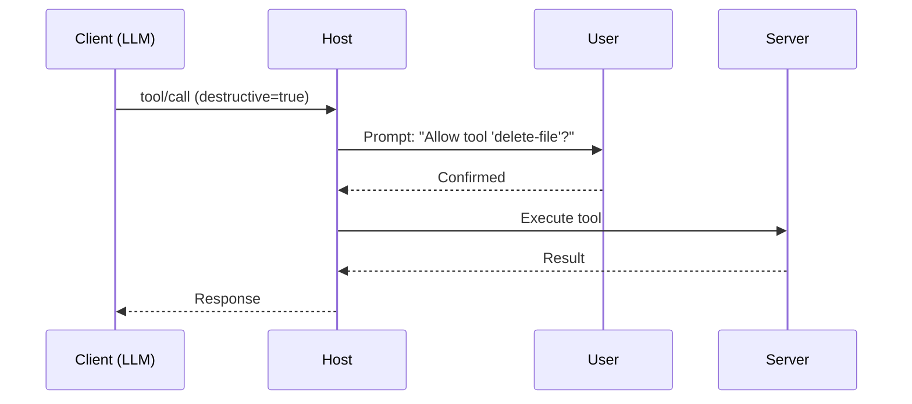

# Appendix D: MCP Security Blueprint

This appendix defines structured strategies for securing Model Context Protocol (MCP) systems. It includes threat models, trust boundary templates, user confirmation flows, and operational hardening guidelines.

---

## 🔐 Zero Trust Role Boundaries

```mermaid
graph TD
  Client[Client (LLM/User)] -->|Request| Host[Host (Policy Enforcer)]
  Host -->|Validated Call| Server[Server (Executor)]
  Server -->|Response| Host
  Host -->|Sanitized Result| Client
```

| Role   | Trusted for...                | Never trusted for...                    |
|--------|-------------------------------|------------------------------------------|
| Client | Sending well-formed requests  | Executing tools or accessing resources   |
| Host   | Schema enforcement, consent   | Internal business logic or model calls   |
| Server | Execution & sampling backend  | User or model authentication             |

---

## 🧭 Consent Flow Template



### Confirmation UX Best Practices
- Always show tool `id`, `label`, and `parameters`
- Optionally describe why the model chose this tool
- Log every consent event with timestamp and session ID

---

## ⚠️ Threat Model Table
| Threat                         | Description                                    | Mitigation                                     |
|--------------------------------|------------------------------------------------|------------------------------------------------|
| Prompt Injection               | LLM manipulated to escape role                | Use render templates, never raw strings       |
| Tool Overreach                 | Client invokes unsafe tool with crafted input | Require confirmation, validate inputs         |
| Root Scope Escalation          | Malicious request bypasses path restriction   | Normalize roots, apply allowlist filters      |
| Server Spoofing                | Host connects to untrusted endpoint           | Use allowlist of MCP Server URLs              |
| Long-Running Execution (DoS)   | Tool hangs or overloads system                | Timeout + process isolation                   |

---

## 🧱 Server Hardening Techniques
- Run tools inside Docker or subprocess chroot jail
- Enforce read-only FS for `resource/read` endpoints
- Deny network access from sampling backends unless needed
- Apply strict schema and type validation

---

## 🧪 Host Hardening Techniques
- Log every call, response, and tool intent
- Rate-limit tool execution per client or session
- Normalize roots before resolution
- Confirm all destructive operations

---

## 🔁 Recommended Defaults
| Setting              | Recommended Default |
|----------------------|---------------------|
| `confirmation`       | true                |
| `destructive`        | true                |
| Tool execution limit | 3/sec/client        |
| Prompt max length    | 2048 tokens         |
| Log retention        | 7–30 days           |

---

## Summary
MCP’s strength lies in enforced structure. All trust flows through the Host. Servers should be isolated, Clients should be constrained, and user consent should be recorded.

This blueprint can be used to generate Host policies, deploy secure containers, and audit runtime behavior in production.