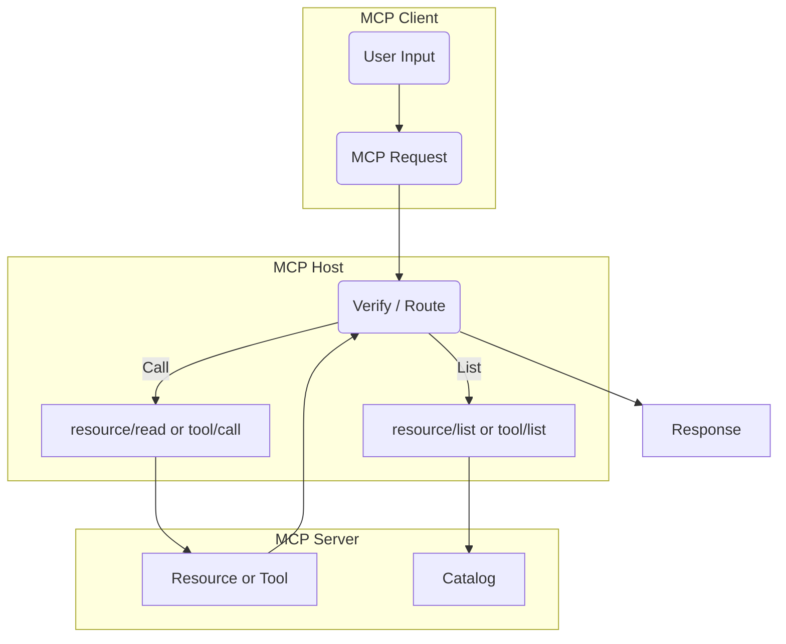

# MCP as Architecture

## Overview
The Model Context Protocol (MCP) is an interface specification designed to mediate between language models (LLMs), tools, memory systems, users, and agentic runtime environments. Unlike traditional APIs, MCP focuses on enabling compositional context, structured agent-tool interaction, and deterministic reasoning over inputs and outputs.

MCP is not tied to a specific implementation, language, or runtime. Instead, it defines a contract that orchestrators and model-serving backends agree to follow. MCP separates:
- **Clients** (typically language models or UIs that request actions or evaluations),
- **Hosts** (which broker messages and enforce boundaries),
- **Servers** (which expose `resources`, `tools`, `prompts`, or `sampling` to clients).

## Core Architecture Diagram (Mermaid)

## Roles Defined
### Client
- Initiates requests to the Host
- Typically an LLM, UI, or scripted agent
- Cannot access Servers directly

### Host
- Enforces protocol rules
- Delegates and routes calls to one or more Servers
- Responsible for attaching context roots, resolving resource URIs, and consent boundaries

### Server
- Exposes functions, resources, sampling interfaces or prompts
- Executes logic and returns results to Host
- Implements: `resource/`, `tool/`, `prompt/`, `sampling/` endpoints

## Core Design Goals
- **Composable context**: Context is passed explicitly and can be layered, segmented, or versioned.
- **Deterministic interaction**: No hidden model calls, no uncontrolled generation.
- **Structured tool use**: Every call has a schema. Agents must declare and confirm intent.
- **Safe delegation**: Separation of roles and boundaries means no model can autonomously execute server-side actions.

## Capabilities Matrix
| Feature         | Client | Host | Server |
|-----------------|--------|------|--------|
| List Resources  | ❌     | ✅   | ✅     |
| Read Resources  | ❌     | ✅   | ✅     |
| Execute Tools   | ❌     | ✅   | ✅     |
| Run Sampling    | ❌     | ✅   | ✅     |
| Call Prompts    | ❌     | ✅   | ✅     |
| Orchestrate LLM | ✅     | ✅   | ❌     |
| Mediate Context | ❌     | ✅   | ❌     |

## Example Scenario: Code Review Agent
1. User sends instruction to review a PR
2. Client (LLM) sends a `tool/call` request to a GitHub Review Tool
3. Host validates the schema, checks user consent
4. Host forwards to the appropriate Server
5. Server executes review logic, returns a report
6. Host formats result, returns it to Client

---

This is the architectural base of MCP — each further chapter will expand one dimension (servers, tools, prompts, roots, etc.) in full technical depth.

