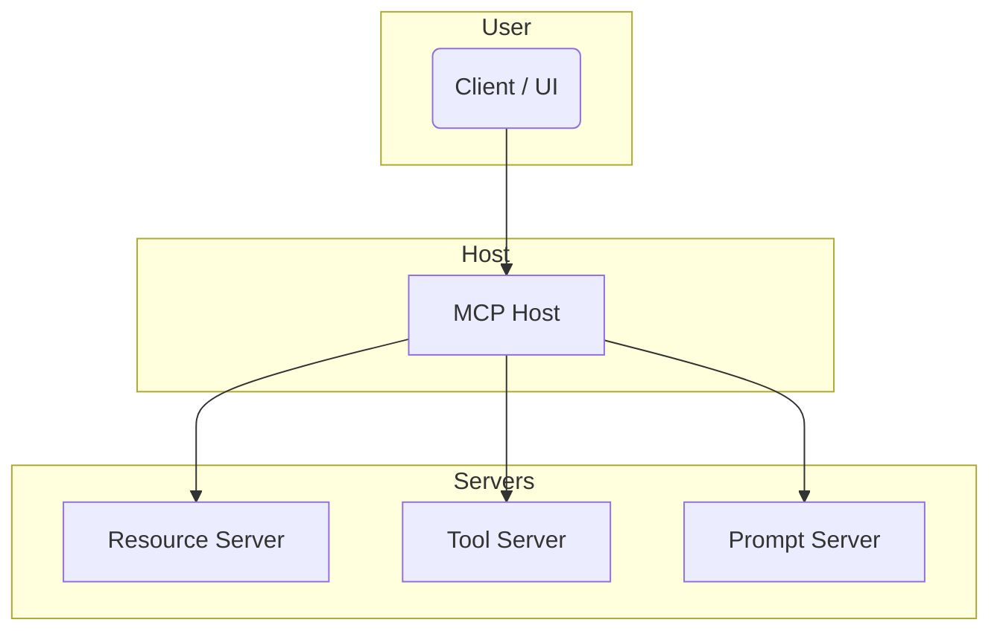

# Deployment Recipes

## Overview
This chapter provides practical **MCP deployment patterns** for different environments — from local prototyping to production setups with multiple Servers and security boundaries. It includes CLI tips, Docker examples, and architecture diagrams.

---

## 🧪 Local Development (Single Server)

**Goal:** Quickly test one Server with a single Host and Client (LLM).

**Structure:**
```bash
host/        # Host code
server/      # MCP server with tool/resource
client/      # LLM or test script
```

**Run:**
```bash
cd server && python3 main.py
cd host && python3 run_host.py
```

**Use with Claude or OpenAI locally** via MCP client adapters.

---

## 🐳 Docker-Based Isolation

**Goal:** Run each component in an isolated container.

**docker-compose.yml**
```yaml
version: '3.8'
services:
  mcp_host:
    build: ./host
    ports: ["4000:4000"]
  mcp_server:
    build: ./server
    ports: ["5000:5000"]
```

**Run:**
```bash
docker compose up --build
```

**Benefits:**
- Simulates isolated trust boundaries
- Easy to test different server types
- Deployable to Kubernetes later

---

## 🔁 CI/CD Testing Pipeline (GitHub Actions)

**Use case:** Ensure MCP server compliance after every commit

**.github/workflows/test.yml**
```yaml
name: Test MCP Server
on: [push]
jobs:
  test:
    runs-on: ubuntu-latest
    steps:
      - uses: actions/checkout@v3
      - run: pip install -r server/requirements.txt
      - run: python3 server/test_server.py
```

Add compliance tests for `tool/list`, `tool/call`, `resource/read`, etc.

---

## 🔐 Hardened Multi-Server Architecture

**Use case:** Secure, multi-tenant MCP deployment (e.g. agent orchestration)



**Features:**
- Scoped root context per project/agent
- Log forwarding from all Servers
- Auth layer before Host
- Dynamic Server registration

---

## 🧱 Serverless MCP Functions (Experimental)

**Use case:** Run lightweight MCP Servers using FaaS (e.g., AWS Lambda, Cloudflare Workers)

**Considerations:**
- Avoid `sampling/` endpoints due to cold-start costs
- Great for `tool/list` and `tool/call`
- Stateless and ephemeral tools work best

---

## Tips for Real Deployment
- Pin all tool versions
- Use `tool/list` as a contract test
- Log every tool + resource call
- Use GitHub Pages or Docusaurus to document your server schemas
- Consider MCP registry pattern for dynamic discovery (future feature)

---

## Summary
Choose a deployment path based on your needs:
- 👨‍💻 Dev: Run locally with FastAPI + Python
- 🐳 Docker: Isolate logic, simulate networks
- 🔁 CI: Test with every commit
- 🔐 Hardened: Multi-agent trust model
- ☁️ Serverless: Ultra-light tool adapters

With this setup, you're ready to go from idea to full MCP-powered production system.

