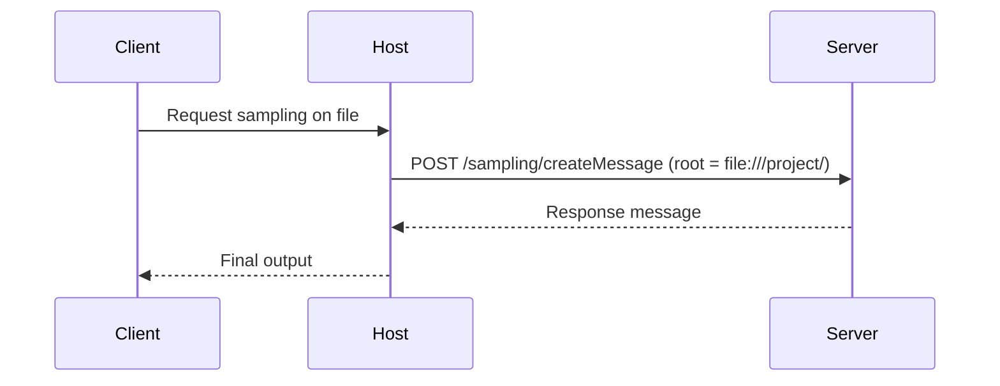

# Sampling and Roots in MCP

## Overview
MCP enables **safe, structured model usage** by delegating sampling (i.e., language model generation) to Servers that explicitly expose a `sampling/createMessage` endpoint. This design separates execution and reasoning — Clients never directly send prompts to LLMs without oversight.

This chapter also introduces **Roots**, which define the base context for resources, tools, or prompts. Roots constrain the accessible scope for a given request or session.

---

## What is Sampling in MCP?

Sampling is the act of generating a message from a model in a controlled environment. In MCP, this is always mediated through the Server.

### Why delegate sampling?
- Prevent unauthorized model access
- Ensure prompts are well-formed and auditable
- Introduce contextual constraints (like roots or resource scopes)

### Endpoint: `POST /sampling/createMessage`
```json
{
  "input": {
    "role": "user",
    "content": "Summarize this file..."
  },
  "history": [...],
  "config": {
    "temperature": 0.7,
    "max_tokens": 500
  }
}
```
Returns:
```json
{
  "message": {
    "role": "assistant",
    "content": "Here is the summary..."
  }
}
```

### Optional Extensions
- `tools`: Suggest tool calls the model might invoke
- `root`: Restrict sampling to a resource context (see below)

---

## Root Contexts
Roots are declared environments in which a model or tool operates. They define **what can be seen, touched, or used**.

### Examples of Root Types:
| Root Type     | Example                            | Notes                            |
|---------------|-------------------------------------|----------------------------------|
| `file:///`    | Project folder                      | Limits to file read/write        |
| `http://`     | API base URI                        | Limits fetch to API scope        |
| `memory://`   | Named memory region                 | Limits recall/summarization      |

Roots can be:
- Assigned per Client or session
- Used to resolve relative resource URIs
- Checked by the Host to enforce boundaries

---

## Workflow: Secure Sampling with Root


---

## Why Roots Matter
Roots enable:
- Sandboxing (limit scope of actions)
- Multi-project separation
- Predictable resource resolution
- Reproducible prompts (context is versioned and structured)

They are central to ensuring that models don’t hallucinate access to things they shouldn’t — and that every interaction can be scoped.

---

## Summary
- `sampling/createMessage` = model call with strict guardrails
- `root` = scoped world for that call
- Host is responsible for enforcing boundaries, context awareness, and rejection of unsafe use

Coming up next: how MCP enforces safety and standardization through structured security models and best practices.

