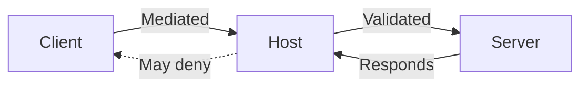
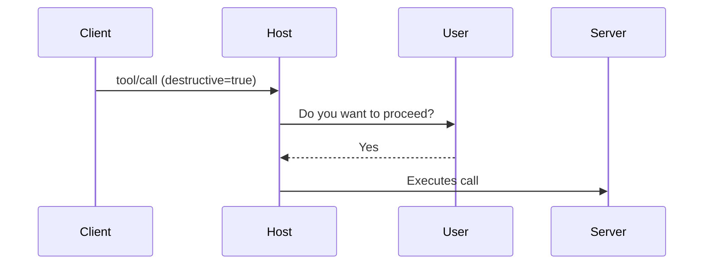

# Security & Best Practices in MCP

## Why Security is Built-In

The Model Context Protocol is designed with **zero-trust architecture principles**:
- Clients cannot access Servers directly
- Every action is mediated and scoped by the Host
- Tool execution and resource reads require explicit intent
- Prompts and model calls can be sandboxed and logged

This chapter defines the core security mechanisms and best practices to safely deploy MCP systems.

---

## Trust Model Overview


### Role Trust Boundaries
| Role   | Trusted to...                         | Not trusted to...                 |
|--------|----------------------------------------|-----------------------------------|
| Client | Follow Host instructions               | Access tools/resources directly   |
| Host   | Enforce schemas and access boundaries | Execute tools itself              |
| Server | Execute logic securely                 | Know the user or client directly  |

---

## Host Responsibilities
The Host is the **security checkpoint**. It:
- Validates JSON Schemas for every request
- Confirms tool intent before calling destructive tools
- Strips or rejects unsafe root references
- Logs all tool/resource access attempts
- Prevents unintended multi-step toolchains

> ✅ TIP: Every Host should include a trust boundary report in its telemetry

---

## Recommended Server Security Measures
- **Input validation**: Validate all `POST` bodies against your schema
- **Sandboxing**: Run tools in restricted subprocesses or containers
- **Read-only by default**: Expose only minimal read/write functionality
- **Escaping**: Protect against shell injection, path traversal, etc.
- **Reject invalid content-types**

Example: Python server validation
```python
if not isinstance(payload.get("text"), str):
    raise HTTPException(400, "Invalid input type")
```

---

## User Consent Flow
Some Hosts may include real user confirmation (e.g., via UI):
- Confirm before tool execution (`confirmation: true`)
- Ask before reading private resources
- Require user to select tools from list instead of free-choice



---

## Attack Surface Considerations
| Vector             | Mitigation                            |
|--------------------|----------------------------------------|
| Over-permissive root | Normalize & restrict scope            |
| Prompt injection    | Use templated prompts, not raw text   |
| Shell execution     | Escape inputs, sandbox execution      |
| Server impersonation| Allowlist trusted Server endpoints     |
| DoS from tools      | Timeout long-running tool calls       |

---

## Deployment Best Practices
- Use HTTPS and secure headers
- Deploy Hosts/Servers in isolated containers
- Rate-limit `tool/call` and `sampling` endpoints
- Audit all logs for tool/resource access
- Keep tools stateless and idempotent where possible

---

## Summary
- The Host is the gatekeeper of safety
- Clients must be treated as untrusted
- Tools and resources must be schema-validated, sandboxed, and observed
- Secure MCP setups are **structured**, not reactive

Next up: Real-world deployment patterns, from local dev to production-grade hosted MCP systems.

