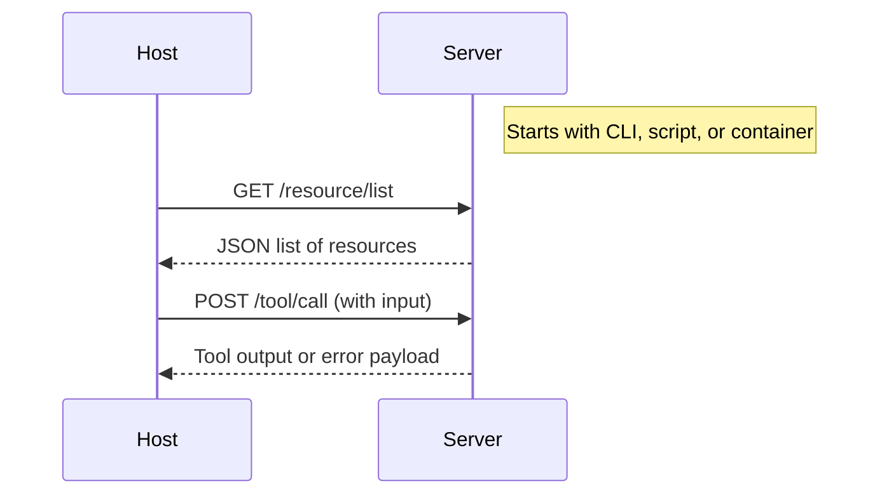

# Writing an MCP Server

## What is an MCP Server?
An MCP Server is any process that exposes capabilities to MCP Hosts via a structured API. These capabilities are grouped into the following namespaces:
- `resource/` — passive or readable elements (files, config, memory entries, etc.)
- `tool/` — functions or actions with side effects
- `prompt/` — prompt templates used to instruct models
- `sampling/` — mechanisms for controlled model interaction

Servers are not aware of clients. They respond to the Host’s requests and must follow the MCP transport conventions.

## Basic Server Lifecycle


## Required Endpoints (v0.1.0)

### `GET /resource/list`
Returns a list of available resources

### `GET /resource/read?id=...`
Returns the contents or metadata of a single resource

### `POST /tool/list`
Returns metadata (schema, label, usage) for available tools

### `POST /tool/call`
Executes a tool using provided parameters

### (optional) `GET /prompt/list`, `POST /prompt/render`
For reusable LLM prompts

### (optional) `POST /sampling/createMessage`
To offload message creation via an embedded model backend

## Example Minimal Server (Python, FastAPI)
```python
from fastapi import FastAPI, Request
from pydantic import BaseModel

app = FastAPI()

# Tool registry
class EchoInput(BaseModel):
    text: str

@app.post("/tool/list")
def list_tools():
    return [{
        "id": "echo",
        "name": "Echo Tool",
        "schema": {"type": "object", "properties": {"text": {"type": "string"}}}
    }]

@app.post("/tool/call")
def call_tool(input: EchoInput):
    return {"result": f"You said: {input.text}"}
```

## Transport Compatibility
Servers can be run as:
- Local HTTP processes
- Docker containers
- WSGI applications
- Unix sockets (with host adapter)

They must:
- Respond to JSON requests
- Follow deterministic schemas
- Use `application/json` and standard HTTP verbs

## Security Considerations
- Validate input schemas strictly
- Avoid executing raw shell commands or unsafe logic
- Consider sandboxing or container isolation
- Never trust host headers or client IPs — only the Host is trusted

## Testing Your Server
You can test with:
```bash
curl http://localhost:8000/tool/list
curl -X POST http://localhost:8000/tool/call \
     -H "Content-Type: application/json" \
     -d '{"text": "Hello MCP"}'
```

## When is a Server MCP-Compliant?
A server is considered MCP-compatible if it:
- Follows the defined endpoints (at least `tool/list` and `tool/call`)
- Uses JSON-serializable inputs/outputs
- Behaves deterministically
- Respects the separation between host and client

---

This chapter serves as a blueprint for implementing compliant and composable MCP servers. In the next section, we'll look at tools and prompts in depth.

‚