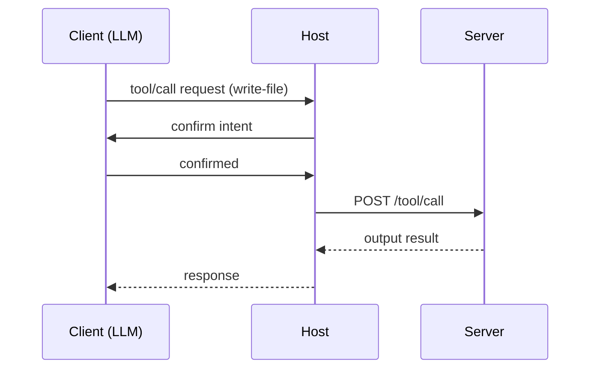

# Tools & Prompts in MCP

## Introduction
MCP introduces a structured interface for tool use by language models and agentic systems. Unlike plugins or generic function calls, MCP tools are:
- Declarative (via JSON Schema)
- Controlled (via Host-confirmed execution)
- Composable (can be selected, nested, or conditionalized)

## What is a Tool?
A **tool** in MCP is any function with input parameters that produces an output — typically with potential side effects. Tools are the primary way for an agent to act on the environment.

Tool metadata is published via `tool/list`, and tools are invoked via `tool/call`.

## Tool Metadata Schema (simplified)
```json
{
  "id": "write-file",
  "label": "Write File to Disk",
  "description": "Writes the given contents to a file.",
  "parameters": {
    "type": "object",
    "required": ["path", "contents"],
    "properties": {
      "path": {"type": "string"},
      "contents": {"type": "string"}
    }
  },
  "confirmation": true,
  "destructive": true
}
```

## Execution Flow


## Confirmation Logic
To prevent accidental or harmful actions, tools can include a `confirmation` field. If set to `true`, the Host must explicitly confirm that the client meant to execute this tool with the proposed parameters.

If `destructive: true`, Hosts may enforce a second confirmation or additional user consent.

## Prompt Templates (Optional)
Prompts in MCP are reusable system messages or preformatted instruction templates for models.
They are accessed via:
- `GET /prompt/list`
- `POST /prompt/render`

### Example prompt:
```json
{
  "id": "summarize-json",
  "template": "Summarize the contents of this JSON: {{json}}",
  "inputs": ["json"]
}
```

### Render call
```http
POST /prompt/render
{
  "id": "summarize-json",
  "values": {
    "json": "{ \"title\": \"Report\", ... }"
  }
}
```

Returns:
```json
{
  "text": "Summary: This is a report..."
}
```

## Prompt Use Cases
- Standardizing model instructions
- Ensuring consistency across agents
- Combining tool results + model reasoning

## Tool Design Guidelines
- **Keep tools pure** if possible (same input → same output)
- **Avoid overly complex input types** — keep schemas simple and atomic
- **Use enums for limited choices**
- **Log tool calls server-side** for audit and debugging

## Tool vs Prompt
| Feature             | Tool                | Prompt              |
|---------------------|---------------------|---------------------|
| Requires execution? | ✅ Yes              | ❌ No               |
| Can mutate state?   | ✅ Yes              | ❌ No               |
| Needs confirmation? | ✅ Usually          | ❌ Never            |
| Server-only?        | ✅ Yes              | ✅ Optional         |

---

This chapter explains how MCP bridges structured tool use with prompt-driven model behavior. In the next section, we'll explore sampling — how models are invoked indirectly through server-controlled flows.

